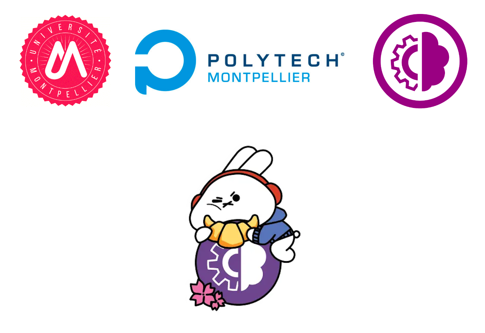
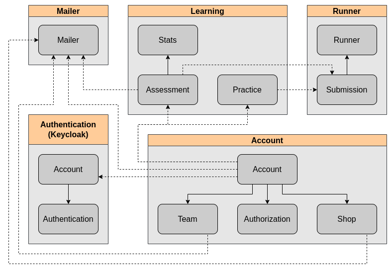
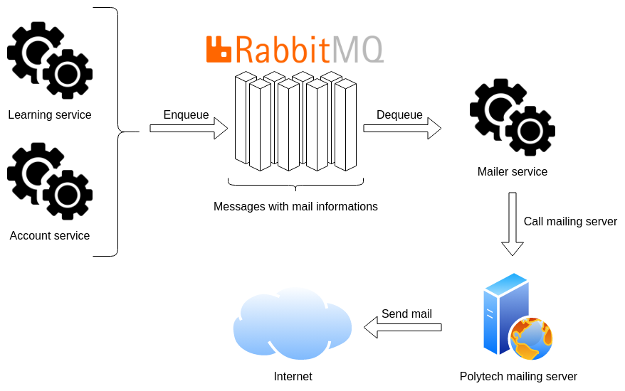

// SAGA si on découpe davantage le service de payment
// Queue pour mailer

= PolyCode Technical Architecture Document - V2 
Alexis Bernard <alexisbernard34310@gmail.com> 
:description: This document describes the technical architecture of PolyCode to the microservices migration. 
:hide-uri-scheme:
:doctype: book
:title-logo-image: 
:sectanchors:
:toc: left
:toclevels: 2
:toc-title: Table of Contents

<<<
:sectnums:

== Introduction

Polycode is a web application. His goal is to provide a simple and intuitive way to learn programming, get certifications, participate in coding campaings, and to make coding interviews.

The application is available at https://polycode.do-2021.fr or http://staging.polycode.do-2021.fr for more functionnalities.

Polycode is actually based on a monolithic architecture. The goal of this document is to explain why and how bring polycode to a microservice architecture, using the cloud patterns learned recently.

== First PolyCode acrhitecture proposal

The previous version of this document is available here : https://alexis-bernard.github.io/polycode-microservice-TAD/

For the first work about the microservice transition, I have done the following proposal.

.PolyCode microservice architecture schema

The five microservices are:

- `Mailer`
- `Authentication` (Keycloak)
- `Account`
- `Learning`
- `Runner`

Each inter process communication (IPC) should be done using http calls, and synchronously.

In the next part, we will see how we will manage better the communication and the discovery between those microservices.

== New PolyCode architecture proposal

First, we will see the changes in the architecture, and then we will see how we will manage the communication and the discovery between the microservices.

=== Architecture changes

First, I choose to split the application in more microservices. Initially, I wanted to have only one microservice for the `Account` service, because my plan is to migrate to microservice slowly. But, if I want implement some new patterns learned recently, i need to split this service to exctract the `Shop` service.

In addition, I have added a new service : An API Gateway. The goal of this service is to be the entry point of the application. It will be responsible to route the requests to the right microservice, manage the authentication, rate limiting, and aggregate the responses.

That's all for the architecture changes. Now, let's see how we will manage the communication and the discovery between the microservices.

=== Communication and discovery

In the previous version of our technical architecture document, we have seen some patterns that we can use to communicate between our microservices, but have an prohitibion to use asynchronous communication. Here, we are free in our choices, then let's speak about the asynchronous communication, beginning with the `Mailer` service.

==== Mailer service communication

The mailer service is responsible to send emails to users or candidates. It is a service that dosen't have any dependencies, and is only used by others services. For example, when a user is invited in a team, the `Account` service will call the `Mailer` service to send the email.

This use case does not need a immediate response from the `mailer`. If an email is not received, there is still a way to send it again. Especially since we would have no guarantee than the mail was well received and read.

Therefore, we will use asynchronous communication for this service. Since we only have this service that uses it, we will not use pub/sub pattern, but a simple queueing system, using RabbitMQ.

In our previous example, the `Account` service will send a message to the rabbitMQ server, and the `Mailer` service will consume this message, and send the email.

The benefits of this pattern are:

* The `Account` service does not have to wait for the `Mailer` service to send the email.
* The `Mailer` service can consume the messages in the queue at its own pace.
* We can scale the `Mailer` service easily by adding multiple consumers, depending on the needed load.

The drawbacks of this pattern are:

* If the scale is not well managed, the queue can grow indefinitely and cause some problems, and the mails will not be sent in a suitable time.

As said before, the chosen queueing system is `RabbitMQ`. There is no particular reason for this choice, except that it is the most widely deployed open source message broker, and it's the only one that I have tested.

Here is the schema of the `Mailer` microservice communication with RabbitMQ message broker:

.Mailer microservice communication

Now, let's speak about another microservice : the `Shop` service.

==== Shop service communication

This service is responsible to manage the items and their quantities. It is used whan an user want to purchase any item (like a hint).

When a user wants to purchase an item, there is two microservices that will be involved : the `Account` service and the `Shop` service.

There is two sensitive points in this use case :

* The `Account` service must be sure that the user has enough money to purchase the item.

* The `Shop` service must be sure that the item is still available.

For those two points, and because we want to use asynchronous communication, we will use the `SAGA` pattern between the `Account` service and the `Shop` service, using RabbitMQ.

===== Sequence diagram of a purchase request

Here is a sequence diagram of a basic request to purchase an item.

.Sequence diagram of a item purchase request
image::https://mermaid.ink/img/pako:eNp9Uk1rwzAM_SvC17Ywxk45FMpWth0GG20vW3YQtrKYJLbrD0Yo_e-Tm7SFBuaDsSW9p6ePg5BWkShEoH0iI-lJ44_HrjTAx6GPWmqHJsIukJ9anzHSL_ZTx0pKm0ycOja1dYN1uDPvYrmcjUwFfL1st-_f8BqpA5e8rDEQ-CwvjHRjaEaNaRj1sVvv1v_CxliGXVCPNckGEksAZ9veWW1iAOyu0s-5GLXIUgvI8uD-7uGWdJYruxGyT1yyjj0okp4mirCNsPbeerBSJk8KWt0QaBNSVXHDiPt1phgQ-eQ8Jz2XMlahgYpZ8FoFJ6qSUQOKjBJz0ZHvUCse9iGbSxFr6qgUBT8V-qYUpTlyHKZoN72Roog-0Vwkp7gJ42KIosI2sJWH-Wnt9U9KR-vfhm06LdXxDzfszOM?type=png[align=center]

// https://mermaid.live/edit#pako:eNp9Uk1rwzAM_SvC17Ywxk45FMpWth0GG20vW3YQtrKYJLbrD0Yo_e-Tm7SFBuaDsSW9p6ePg5BWkShEoH0iI-lJ44_HrjTAx6GPWmqHJsIukJ9anzHSL_ZTx0pKm0ycOja1dYN1uDPvYrmcjUwFfL1st-_f8BqpA5e8rDEQ-CwvjHRjaEaNaRj1sVvv1v_CxliGXVCPNckGEksAZ9veWW1iAOyu0s-5GLXIUgvI8uD-7uGWdJYruxGyT1yyjj0okp4mirCNsPbeerBSJk8KWt0QaBNSVXHDiPt1phgQ-eQ8Jz2XMlahgYpZ8FoFJ6qSUQOKjBJz0ZHvUCse9iGbSxFr6qgUBT8V-qYUpTlyHKZoN72Roog-0Vwkp7gJ42KIosI2sJWH-Wnt9U9KR-vfhm06LdXxDzfszOM

==== Other microservices communication

For the other microservices, we will use synchronous communication, as said in the previous version of the TAD.

Then, we will use a REST API. The reason is that it is a well-known pattern, and it is easy to use.

==== Service discovery

For the service discovery, don't change anything from the previous TAD proposal. We will use the third-party registration pattern. We will use the `Consul` service registry. The reason is that it is a well-known service registry. We will use the self-managed version of Consul (open source) with kubernetes, because the PolyCode application is not deployed in a cloud environment, but on private servers, at Polytech.

Here is the schema of the PolyCode service discovery with Consul:

.PolyCode service discovery with Consul
image::images/PolyCode service discovery with Consul.png[align=center]

In this schema, we can see that each microservice is deployed in a kubernetes pod. Each pod has the microservice and a sidecar container, that is responsible to register, deregister and query the service. The sidecar container is made up of two parts: the dataplane and an envoy proxy. The envoy proxy is responsible to communicate with the service, and make load-balacing, and the dataplane with the consul control plane. The consul control plane is responsible to keep the global state of the cluster.